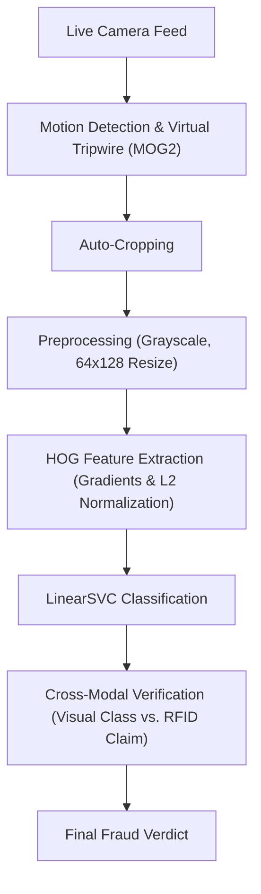

# TruthTag: Cross-Modal FASTag Fraud Detection

TruthTag is a highly efficient, classical Computer Vision pipeline engineered to eliminate toll evasion and revenue leakage. By intentionally avoiding the heavy computational overhead of deep learning, TruthTag operates rapidly on edge devices. It cross-verifies digital RFID (FASTag) claims against the actual physical geometry of the vehicle passing through the toll, automatically flagging discrepancies and detecting fraud in real-time.

## Architecture Pipeline



## System Components

| Component | Role | Tech Stack |
| :--- | :--- | :--- |
| **UI / Dashboard** | Interactive frontend for operators and fraud visualization | Streamlit |
| **Computer Vision** | Image ingestion, virtual tripwire, and bounding box crops | OpenCV |
| **Machine Learning** | High-dimensional boundary classification (Support Vector Machine) | Scikit-Learn |
| **Feature Matrix Math** | Fast, large-scale matrix operations and tensor manipulation | NumPy |

## Algorithmic Foundation

For a deep dive into the calculus and linear algebra powering our feature extraction and classification, please see our [Mathematical Pipeline Documentation](algorithmic_foundation/Mathematical_Pipeline.md).

## Quick Start

### 1. Clone the Repository

```bash
git clone https://github.com/Kunal-Somani/TruthTag-Toll-Audit.git
cd TruthTag-Toll-Audit
```

### 2. Install Dependencies

```bash
pip install -r requirements.txt
```

### 3. Run the Dashboard

```bash
streamlit run app.py
```

### 4. Presenting (Local Area Network)

To demo the system from your laptop to another device over the same Wi-Fi network, start the server using the port flag:

```bash
streamlit run app.py --server.port 8501
```

## Contributors

| Name | GitHub | LinkedIn |
| :--- | :--- | :--- |
| **Kunal** | [GitHub Profile](https://github.com/Kunal-Somani) | [LinkedIn Profile](#) |
| **Ujjwal Aggarwal** | [GitHub Profile](#) | [LinkedIn Profile](#) |
